## アカウント作成

1. Flourishのサイトのアカウントを作成する
   1. https://flourish.studio/ を開く
   2. 画面内のGet started for free ボタンを押す
   3. 画面の案内に従ってアカウントを作成する

## グラフの作成

#### 新規作成とデータの投入

1. Flourishのサイトを開いてログインをする

2. New visualizationボタンを押す

   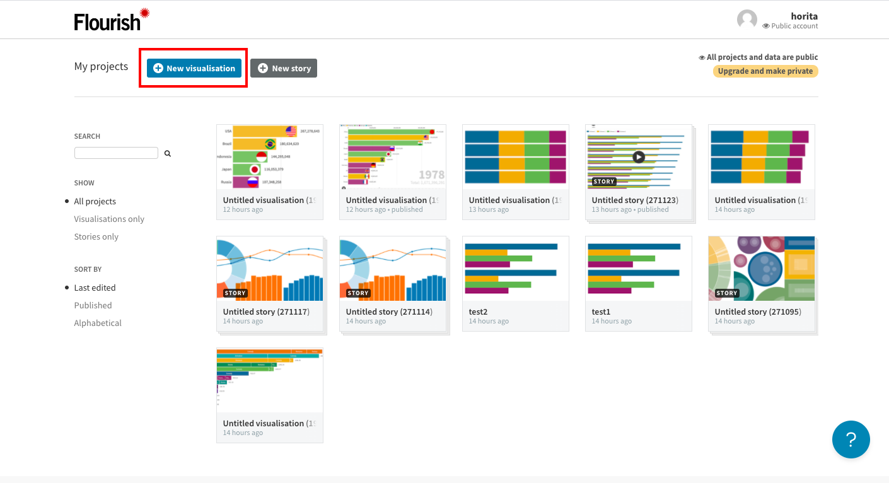

3. 画面を下にスクロールしてBar chart raceを選択する

   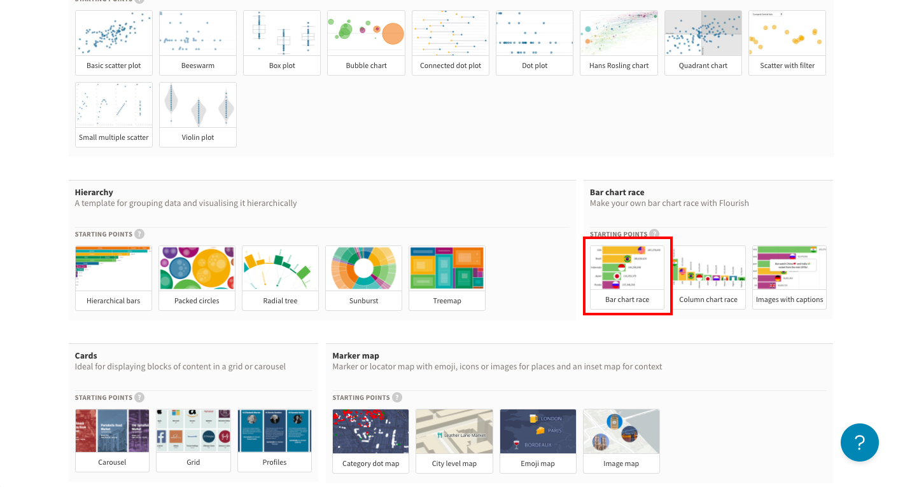

4. Dataを押す

   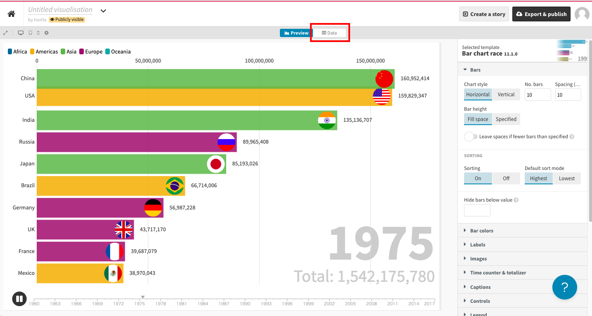

5. データを適宜編集する

   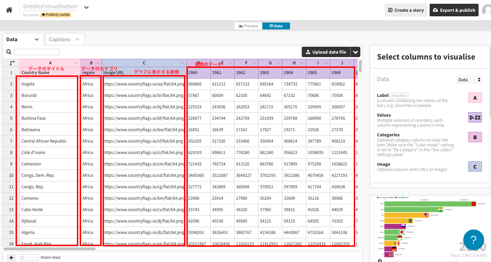

   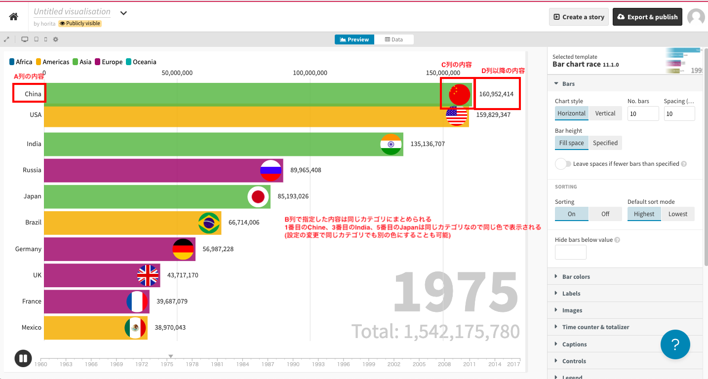

#### 見栄えの変更

1. データ投入後にPreviewを押す

   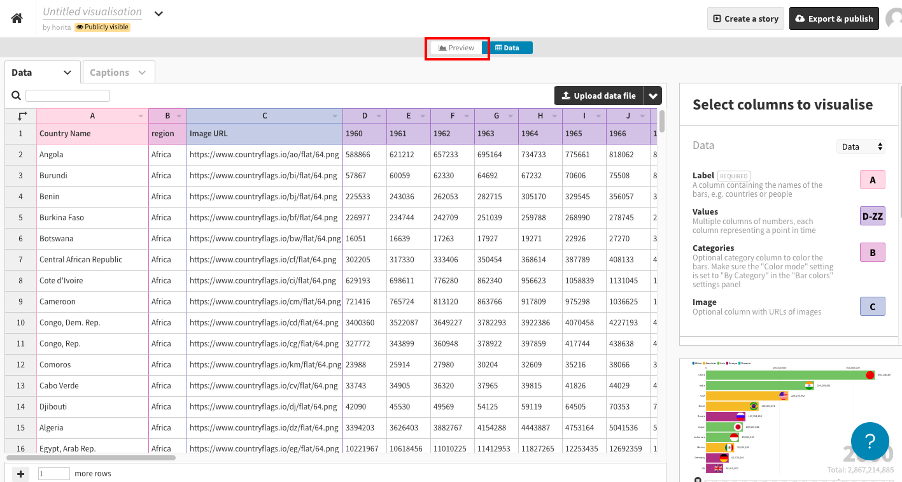

2. 画面右側にあるパネルから適宜スタイルを変更する

   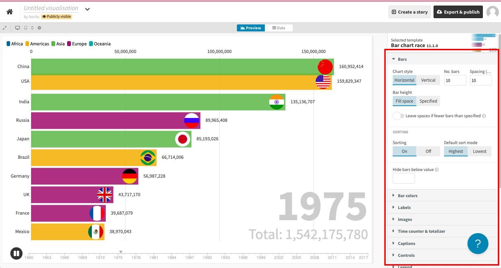

   - 背景を変えたい場合はLayoutの項目にあるColorを変更する

     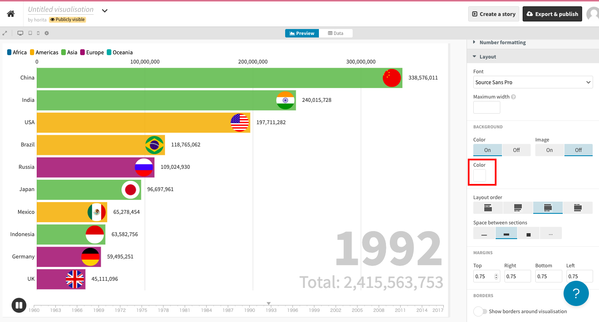

## htmlの作成

1. 作成をしたグラフのExport & publishを押す

   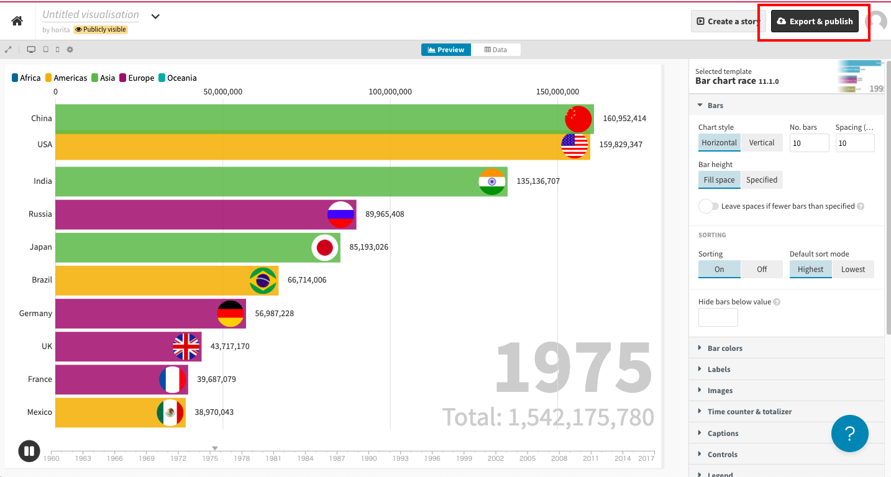

2. Publis to share and embedを押す

   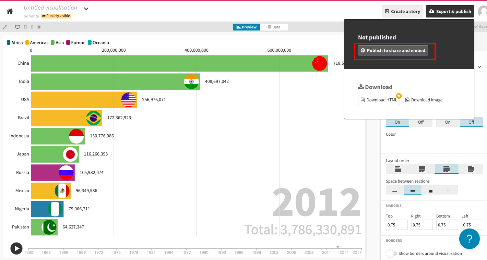

3. 確認ダイアログが出たらpublishを押す

4. htmlで確認をする

   - ホームページとしてみたい場合はhttps:// から始まるリンクをそのままブラウザで開けば閲覧可能。

   - パソコン上にhtmlファイルとして保存しておきたい場合は以下のようにする

     1. Embed on your websaiteの中にある文字をコピーする

        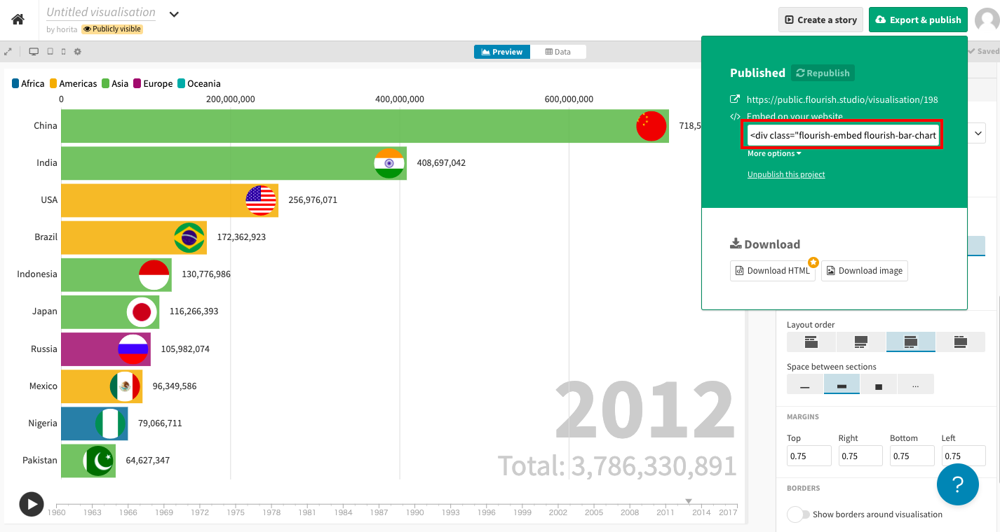

     2. index.htmlをテキストエディタで開いて`
`の部分をコピーした内容で書き換える

     3. index.htmlをブラウザで開く

